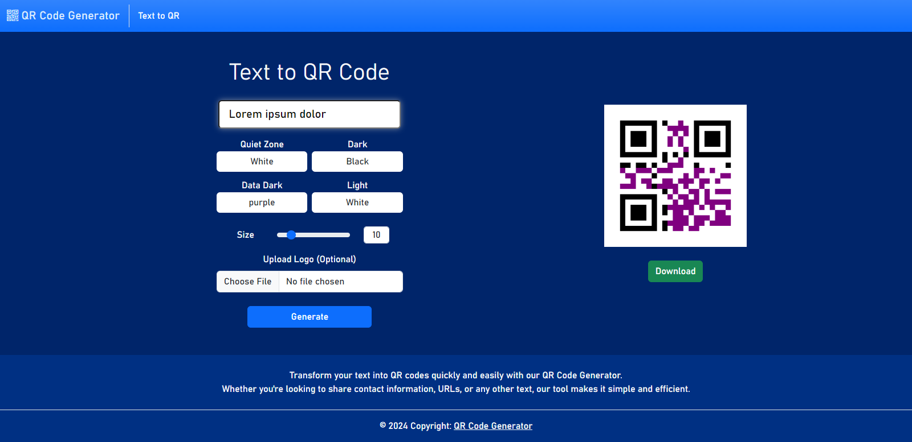

# QR Code Generator

A simple QR Code generator built with Python and Flask. This project allows users to create QR codes from input text, URL, or other data. The generated QR codes can be displayed on a web page and downloaded as image files.
### An example of a QR Code: 

## Installation

1. Clone the repository.
2. Download Bootstrap and Bootstrap Icons:
   - Download Bootstrap and Bootstrap Icons files from [https://getbootstrap.com/](https://getbootstrap.com/).
   - Save the Bootstrap files in a folder named `bootstrap` and the Bootstrap Icons in a folder named `bootstrap-icons` within the `static` directory of your project.
3. Run the Application (`QR-Code.py`).
4. Access the Application:
   - Open your web browser and navigate to `http://localhost:5000` to use the application.
5. Enjoy Creating QR Codes!

